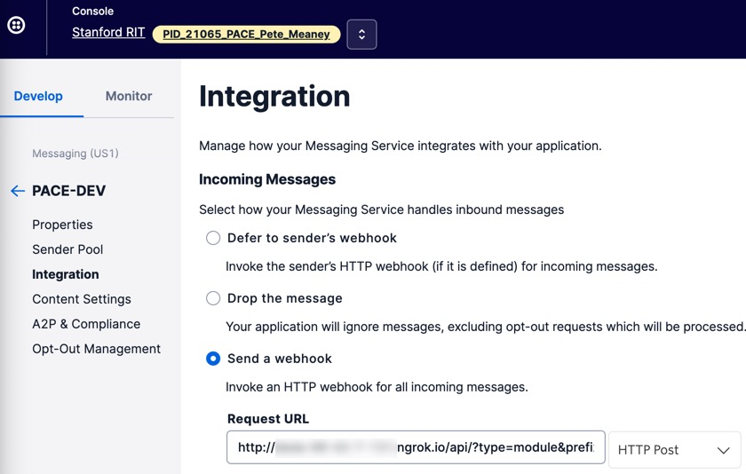

# Developer Setup

The following notes should help set up REDCap with What's App by Twilio

## Twilio Setup

1. Set up your Twilio Account
2. Purchase a Phone Number
3. Create a message service and associate it to your number
4. Create a What's App enabled sender
5. Register a What's App Sender (requires approval)
6. Create a Message Service to handle these messages and associate it to your sender
7. You must register approved What's App Templates.  What's App and Twilio have complex rules about what content you can sent to a What's App number.  The content depends on whether or not your are in an 'open session' or not.  An open session lasts 24 hours and begins when a participant replies to your phone number.  In most cases you will NOT have an open session with a participant and will have to use a 'template' to message them.  We suggest creaing an 'ice breaker' template that can be used to open a new open session.

TODO: Document better the next time someone goes through this process... It was long and difficult for us the first time around.

## REDCap Setup
1. Install the external module and goto configure
2. Apply the 'default' project for testing (see xml file in 'documentation' folder)
   1. TODO: Make a better testing project
3. Enable the module on your new project
   1. Enter in your Twilio account SID and token, the from number (in correct format) in project EM settings
   2. For local development, goto the control center and edit EM system settings and specify a local 'override url'
      1. Twilio needs to be able to call your server.  When developing locally, I use ngrok for this, e.g.:  `ngrok http 80` which gives me a url like: `http://9d67-98-42-7-123.ngrok.io`
      2. Once you've done this, you need to tell Twilio to send callbacks to the correct EM address.  To get the address, goto your control panel and click on the `What's App Info` em page.  You should see an Inbound Url.  Copy and paste this value.
      3. Goto Twilio and place this url as the inbound web services for your messages.  Depending on how your configure your Twilio Message Service you can either place this url on your incoming phone number OR you can place it on the incoming service.  For now, I'll use the phone number.
         1. Messaging / Services / Integration
         2. Specify Incoming messages to use a Send a Webhook and enter the url from Step 2 above...

## XDebug configuration
1. Each time refreshing ngrok urls, you must update path mappings in PHPStorm for Xdebug
2. Add /var/www/html as the path mapping to the www folder on the server to the new entry
